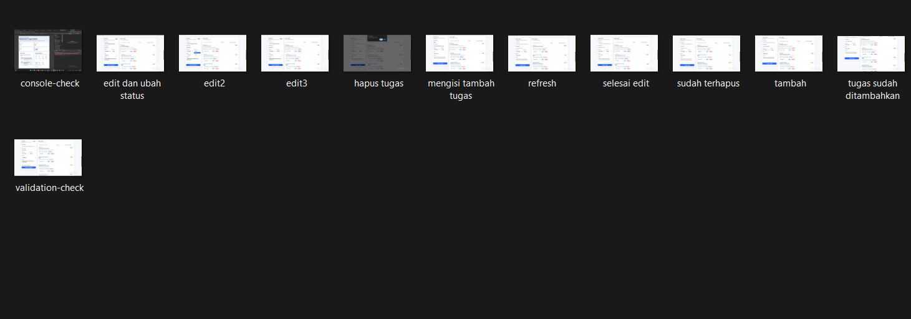

# Student Task Tracker

Student Task Tracker adalah web app sederhana untuk membantu mahasiswa mencatat, mengelola, dan memantau tugas kuliah. Aplikasi ini berfokus pada deadline, prioritas, status pengerjaan, progres mata kuliah, dan penyimpanan lokal menggunakan browser.

## Features

- Tambah, edit, hapus, dan ubah status tugas.
- Simpan detail tugas: judul, mata kuliah, deadline, prioritas, status, catatan, waktu dibuat, dan waktu diperbarui.
- Dashboard ringkasan: tugas terlambat, tugas minggu ini, tugas selesai, dan persentase selesai.
- Daftar fokus untuk tugas urgent dan prioritas tinggi.
- Filter tugas berdasarkan semua, terlambat, minggu ini, belum selesai, selesai, dan prioritas tinggi.
- Filter tambahan berdasarkan mata kuliah.
- Pencarian berdasarkan judul tugas, mata kuliah, atau catatan.
- Kartu mata kuliah aktif dengan progress bar.
- Timeline deadline yang diurutkan dari deadline terdekat.
- Kalender mini untuk melihat sebaran deadline per bulan.
- Mode terang/gelap.
- Data tersimpan di `localStorage`, sehingga tetap ada setelah refresh.

## Setup Instructions

Project ini memakai plain HTML, CSS, dan JavaScript. Tidak perlu install dependency untuk menjalankan aplikasi.

### Run dengan membuka file langsung

1. Buka folder project:

   ```bash
   cd task-tracker
   ```

2. Buka file berikut di browser:

   ```text
   src/index.html
   ```

### Run dengan local server

Alternatifnya, jalankan local server dari folder project:

```bash
cd task-tracker
python -m http.server 8000
```

Lalu buka:

```text
http://localhost:8000/src/index.html
```

## Usage Guide

1. Buka aplikasi di browser.
2. Isi form **Tambah Tugas** dengan judul tugas, mata kuliah, deadline, prioritas, status, dan catatan opsional.
3. Klik **Tambah Tugas** untuk menyimpan tugas.
4. Gunakan daftar **Semua Tugas** untuk melihat tugas yang tersimpan.
5. Klik **Edit** untuk mengubah detail tugas.
6. Ubah status langsung dari dropdown status pada kartu tugas.
7. Klik **Hapus** untuk menghapus tugas yang tidak diperlukan.
8. Gunakan pencarian dan filter untuk mempersempit daftar tugas.
9. Lihat dashboard, daftar fokus, mata kuliah aktif, timeline, dan kalender mini untuk memantau progres.
10. Refresh halaman untuk memastikan data tetap tersimpan dari `localStorage`.

## Screenshots

Screenshot hasil browser testing:



Lokasi file:

```text
assets/screenshots/browser-testing-evidence.png
```

## Tech Stack

- HTML5
- CSS3
- JavaScript
- Browser `localStorage`
- Node.js untuk test sederhana

## Testing

Jalankan automated test:

```bash
node tests/app.test.js
```

Expected result:

```text
Student Task Tracker tests passed
```

Browser testing checklist tersedia di:

```text
docs/05-tdd-and-testing.md
```

## Project Structure

```text
task-tracker/
├── README.md
├── docs/
│   ├── 00-submission-checklist.md
│   ├── 01-requirements.md
│   ├── 02-prd.md
│   ├── 03-vertical-slice-issues.md
│   ├── 04-design.md
│   ├── 05-tdd-and-testing.md
│   ├── 06-reflection.md
│   └── 07-github-workflow.md
├── src/
│   ├── index.html
│   ├── style.css
│   └── app.js
├── tests/
│   └── app.test.js
├── assets/
│   └── screenshots/
│       ├── browser-testing-evidence.png
│       ├── calendar-view.png
│       ├── console-check.png
│       ├── localstorage-devtools.png
│       └── ...
└── .github/
    ├── ISSUE_TEMPLATE/
    │   └── vertical-slice.md
    └── pull_request_template.md
```

## License

MIT License. Project ini boleh digunakan, dimodifikasi, dan dikembangkan untuk kebutuhan belajar atau pengembangan pribadi.
